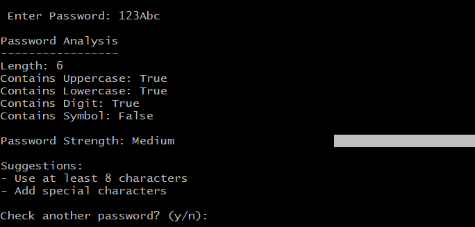
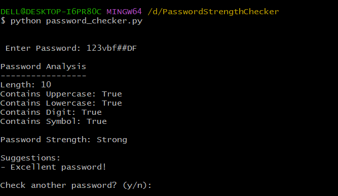

# DecodeLabs Tasks

## Project 1 - Password Strength Checker

A Python-based Password Strength Checker that analyzes passwords and classifies them as Weak, Medium, or Strong.

### Features
- Password Length Check
- Uppercase Letter Check
- Lowercase Letter Check
- Number Check
- Symbol Check
- Security Suggestions

## Screenshots






## Project 2 - Caesar Cipher Encryption & Decryption

A Python implementation of the Caesar Cipher algorithm.

### Features
- Encrypt text using a shift key
- Decrypt encrypted text
- Supports uppercase and lowercase letters
- Preserves numbers and special characters

## Technologies Used

- Python
- CustomTkinter
- Git
- GitHub
# 🔐 Phishing Email Detector

A simple Python-based cybersecurity project that detects phishing emails using suspicious keywords and URL analysis.

## Features

- Detect phishing keywords
- Identify suspicious URLs
- Calculate risk score
- Classify emails as Safe, Suspicious, or Phishing
- Generate analysis report

## Technologies Used

- Python
- Tkinter
- Matplotlib
- ReportLab

## Run Project

```bash
pip install matplotlib reportlab
python main.py
```

## Sample Output

- ✅ Safe Email
- ⚠️ Suspicious Email
- 🚨 High Risk Phishing Email

## Author

Faiza Sajjad
